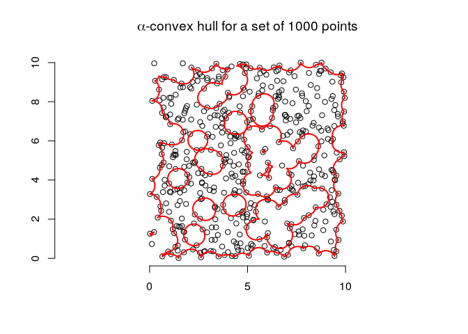

RcppAlphahull installation and first test
================

## Installation

Up to now is possible to install this package easily on Linux and in
order to do that I suggest to follow the following procedure:

  - install R development package with the command `sudo apt-get install
    r-base-dev` in the command line;
  - open R with the command `R` in command line or, if you have
    installed [Rstudio desktop
    version](https://www.rstudio.com/products/rstudio/download/#download),
    open it;
  - install the library `devtools` with the command
    `install.packages('devtools')`, this may take a while depending on
    the tools that have been already installed on your R version if you
    already had it;
  - unlickily the devtools command `install_github` apparently does not
    install packages dependencies, so I suggest to install the package
    `alphahull` directly with the command
    `install.packages('alphahull')`;
  - install `RcppAlphahull` using the command
    `devtools::install_github("https://github.com/federicoairoldi/ProgettoPACS",
    subdir = "RcppAlphahull")`.

If no error occurs the installation has worked fine.

## A first example test

After the installation we can run the following code to perform a small
simple test. The plot shows the α-convex hull in red, the α-shape in
pink and the Voronoi diagram in grey.

``` r
library(RcppAlphahull) # loading the package
n = 50
set.seed(1)
x = runif(n) # sampling the points
y = runif(n)
alpha = 0.1

ahull.example = ahull(x,y,alpha)

plot(ahull.example, asp = 1, do.shape = T, wlines = "vor", xlab = "", ylab = "", pch = 19, 
     col = c("red","pink","black","grey","grey","black"), main = "Your 1st test with RcppAlphahull")
```

<!-- -->

## How can you be sure I’m not cheating?

Since the function that performs the computation have the same name in
the two packages one can think that I just embedded the `alpahull` code
in a sort of wrapper package. If you want to test such eventuality you
can execute the code below.

``` r
n = 500
set.seed(1)
x = runif(n,0,10) # sampling the points
y = runif(n,0,10)
alpha = 0.5
  
system.time(RcppAlphahull::ahull(x,y,alpha))
```

    ##    user  system elapsed 
    ##   0.083   0.000   0.192

``` r
system.time(alphahull::ahull(x,y,alpha))
```

    ##    user  system elapsed 
    ##   2.129   0.057   3.730

By runnning this code one should see that the `RcppAlpahull` function
performs more faster than the `alpahull` one. The result of the α-convex
hull computation is shown in the following plot.

<!-- -->
